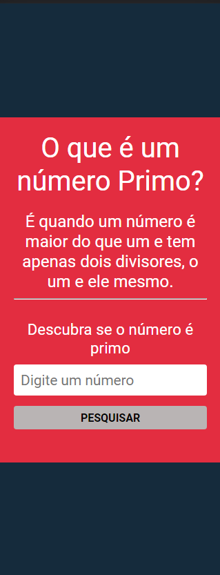

# Sistema de verificação para saber se um número é primo.

## Índice

  - [Visão Geral](#visão-geral)
    - [O projeto](#o-projeto)
    - [Screenshot](#screenshot)
    - [Link](#link)
  - [Contrução](#construção)
    - [Construído com](#construído-com)

## Visão Geral

### O projeto

Os usuários deverão:

- Digitar um número para verificar se o mesmo é primo ou não;
- Logo em seguida, clicar em PESQUISAR para visualizar o resultado;
- Os usuários poderão pesquisar qualquer número e quantas vezes for necessário.

### Capturas

### Link

- link do site: [clique aqui](https://your-live-site-url.com)

## Construção

### Construído com

- HTML5
- CSS
- SASS
- JavaScript
